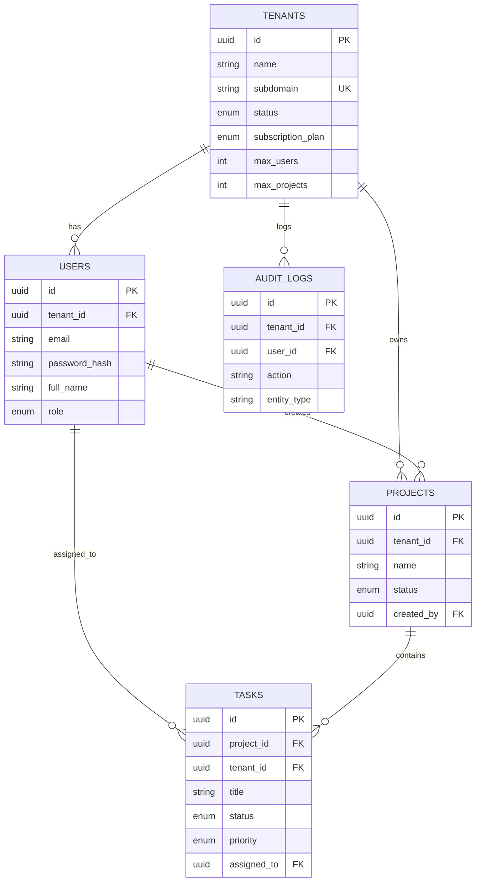

# System Architecture

## 1. System Architecture Diagram

```mermaid
graph TD
    Client[Client Browser (React App)]
    LB[Load Balancer / Nginx]
    API[Backend API (Node.js/Express)]
    DB[(PostgreSQL Database)]

    Client -- HTTPS --> LB
    LB -- HTTP --> API
    API -- SQL --> DB

    subgraph "Docker Network"
    API
    DB
    end

    subgraph "External World"
    Client
    end
```

**Flow**:
1.  User accesses the Frontend Application.
2.  Requests are sent to the Backend API (via Nginx or direct port mapping in Dev).
3.  Backend authenticates request using JWT.
4.  Backend queries PostgreSQL, injecting `tenant_id` context.
5.  Response is returned to Client.

## 2. Database Schema (ERD)



## 3. API Architecture

### Authentication
-   `POST /api/auth/register-tenant`: Public. Register new tenant + admin.
-   `POST /api/auth/login`: Public. Email + Password + Subdomain -> JWT.
-   `GET /api/auth/me`: Private. Get current user info.
-   `POST /api/auth/logout`: Private.

### Tenants
-   `GET /api/tenants`: Private (Super Admin). List all tenants.
-   `GET /api/tenants/:tenantId`: Private. Get details.
-   `PUT /api/tenants/:tenantId`: Private (Admin). Update details.

### Users
-   `POST /api/tenants/:tenantId/users`: Private (Admin). Create user.
-   `GET /api/tenants/:tenantId/users`: Private. List users.
-   `PUT /api/users/:userId`: Private. Update user.
-   `DELETE /api/users/:userId`: Private (Admin). Delete user.

### Projects
-   `POST /api/projects`: Private. Create project.
-   `GET /api/projects`: Private. List projects.
-   `PUT /api/projects/:projectId`: Private. Update project.
-   `DELETE /api/projects/:projectId`: Private. Delete project.

### Tasks
-   `POST /api/projects/:projectId/tasks`: Private. Create task.
-   `GET /api/projects/:projectId/tasks`: Private. List tasks.
-   `PUT /api/tasks/:taskId`: Private. Update task.
-   `PATCH /api/tasks/:taskId/status`: Private. Update status.
